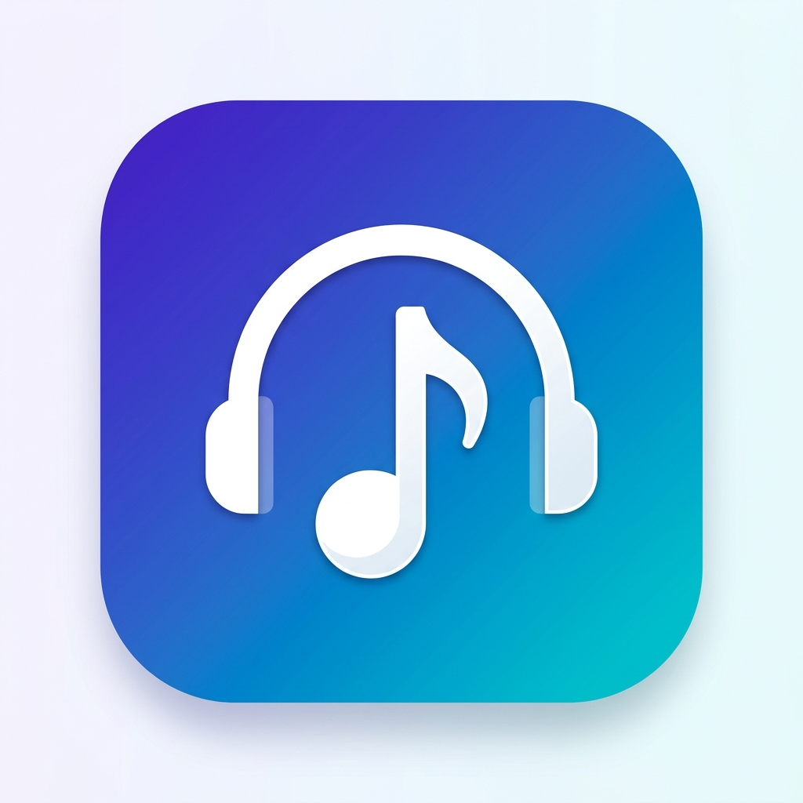

# BH Music

<p align="center">
  
</p>

<p align="center">
  <b>BH Music</b> 是一款基于 React 和 Capacitor 构建的现代跨平台音乐播放器。<br>
</p>

<p align="center">
  基于 <a href="https://music-api.gdstudio.xyz/api.php">GD Studio's API</a> 的多音源聚合音乐播放器
</p>

<p align="center">
  
  
  
  
  
</p>

## ✨ 特性

- 🎵 **跨平台**：支持 Android、Web（PWA）。
- 🎨 **现代化 UI**：全新设计的播放界面与精美的 UI 交互体验。
- ⚡ **轻量级**：核心无臃肿，播放流畅。
- 🔌 **插件化架构**：支持自定义数据源插件。
- ☁️ **云端同步**：支持多端同步播放列表与设置。
- **多音源聚合与回退**：支持多源检索与播放失败回退（本地下载/缓存/直连/代理/下一首）。
- **智能音源自动匹配**：可自动切换到可用免费音源，并同步队列/歌单/喜欢状态。
- **歌单广场与播客**：支持网易云歌单、我的歌单、RSS 播客订阅以及 Alist 站点配置。
- **歌单管理增强**：支持搜索、去重、导出、封面设置、URL 添加歌曲，支持主流音乐平台的歌单导入。
- **下载管理**：支持选择下载音质、下载目录、是否嵌入歌词或封面。
- **播放生态**：支持播放列表、最近播放、个人歌单、歌词显示、音质选择、倍速调节、睡眠定时、主题切换与数据同步配置。
- **移动端体验完整**：支持 PWA 安装、Android 打包与 Media Session 集成，网页端也能接近原生体验。

## 音源支持

| 音源             | 搜索 | 播放 | 歌词 | 歌单导入 | 备注                               |
| ---------------- | :--: | :--: | :--: | :------: | ---------------------------------- |
| 网易云音乐🌟     |  ✅  |  ✅  |  ✅  |    ✅    | GD Studio API                      |
| Netease          |  ✅  |  ✅  |  ✅  |    ✅    | 网易云官方，搜索建议/专辑/歌手详情 |
| Joox🌟           |  ✅  |  ✅  |  ✅  |    ❌    | GD Studio API                      |
| B站🌟            |  ✅  |  ✅  |  ❌  |    ❌    | 仅移动端，支持视频分P/合集         |
| 酷我音乐         |  ✅  |  ✅  |  ✅  |    ✅    | GD Studio API                      |
| 咪咕音乐         |  ✅  |  ✅  |  ✅  |    ✅    | 仅移动端                           |
| QQ音乐           |  ✅  |  ✅  |  ✅  |    ✅    | QQ音乐官方                         |
| 酷狗音乐         |  ❌  |  ❌  |  ❌  |    ✅    |                                    |
| 小蜗音乐         |  ✅  |  ✅  |  ✅  |    ❌    | 酷我音源（洛雪），URL 走 LX API    |
| 小秋音乐         |  ✅  |  ✅  |  ✅  |    ❌    | QQ音源（洛雪），URL 走 LX API      |
| 本地音乐         |  ❌  |  ✅  |  ✅  |    ❌    | 仅移动端支持                       |
| 播客（歌单广场） |  ✅  |  ✅  |  ❌  |    ❌    | RSS 播客订阅                       |
| Alist（歌单广场）|  ✅  |  ✅  |  ❌  |    ❌    | 仅音频，如 ASMR 站                 |

> [!NOTE]
> **兼容性说明**
>
> 最低支持版本：minSdkVersion = 24 (Android 7.0)
>
> 若出现界面排版错乱、图标异常等问题，请先更新 Android System WebView 至较新版本（建议 WebView 100+ 的版本）。

## 快速开始

```bash
npm install
npm run dev
```

## 常用脚本

```bash
# 构建
npm run build

# 类型检查
npm run typecheck

# 代码检查
npm run lint

# 测试
npm run test
```

## Android 构建

环境要求：Node.js (建议 v20+)、Android Studio 及 Android SDK、Java JDK 17

```bash
# 1. 安装依赖
npm install

# 2. 构建前端静态资源
npm run build

# 3. 同步资源到 Android 工程
npx cap sync android

# 4. 在 Android Studio 中打开并运行，或者直接执行打包命令
npm run build:android:debug
```

Debug APK 输出路径：

- `android/app/build/outputs/apk/debug/app-debug.apk`

## 📦 部署指南 (Cloudflare Pages)

1. **创建项目**：在 [Cloudflare Dashboard](https://dash.cloudflare.com/) 创建 Pages 项目。
2. **构建配置**：
   - **Build command**: `npm run build`
   - **Build output directory**: `dist`
3. **环境变量**：
   - `PASSWORD`: 设置你的管理员密码，用于管理`SYNC_KEY`（必须）
4. **KV 绑定**：
   - 创建 KV Namespace 命名为 `oh_file_url`
   - 在 Pages 设置中绑定该 KV，变量名设为 `oh_file_url`

> 自建后端可在前端页面「设置 → API 地址」中填入自定义域名。
>
> `https://<你的域名>/admin` 路径用于管理 SYNC_KEY。

## 免责声明

本项目不存储任何音频资源，接口均来自互联网公开资料，仅供技术交流。

严禁商业用途，由此产生的版权风险由使用者自行承担。

## 📜 许可

本项目基于原作者项目深度定制，保留原开源协议 (MIT)。
